<div align="center">

# AxonHub - 统一 AI 网关系统 | Unified AI Gateway

</div>

<div align="center">

[](https://github.com/looplj/axonhub/actions/workflows/test.yml)
[](https://github.com/looplj/axonhub/actions/workflows/lint.yml)
[](https://golang.org/)
[](https://opensource.org/licenses/MIT)
[](https://docker.com)

[English](README.md) | [中文](README.zh-CN.md)

</div>

---

## 📖 项目介绍 | Project Introduction

### 统一 AI 网关

AxonHub 是一个现代化 AI 网关系统，提供统一的 OpenAI, Anthropic, AI SDK 兼容 API 层，通过转换器管道架构将请求转换到各种 AI 提供商。系统具备完整的追踪（Trace）能力，帮助企业更好地管理和监控 AI 服务使用情况。并且具备完善的测试覆盖，保障系统的稳定性和可靠性。

<div align="center">
  
</div>

### 解决的核心问题

| 问题 Problem | AxonHub 解决方案 Solution |
|-------------|-------------------------|
| **供应商锁定** Vendor Lock-in | 🔄 统一 API 接口，随时切换提供商 |
| **可扩展性** Extensibility | 灵活的 transformer 架构，支持多种转换器 |
| **服务中断** Service Outages | ⚡ 自动故障转移，多渠道冗余 |
| **权限管理** Permission Management | 📊 完善的用户权限管理 |
| **开发复杂性** Development Complexity | 🛠️ 单一 SDK，统一接口标准 |

---

## 📚 文档 | Documentation

### DeepWiki
详细的技术文档、API 参考、架构设计等内容，可以访问 [AxonHub DeepWiki](https://deepwiki.com/looplj/axonhub)。

---

## 🎯 演示 | Demo

在我们的 [演示实例](https://axonhub.onrender.com) 上体验 AxonHub！

**注意**：演示网站目前只配置了一个用于测试的虚拟渠道，返回固定内容。

### 演示账号 | Demo Account
- **邮箱 Email**: demo@example.com
- **密码 Password**: 12345678

---

## ⭐ 核心特性 | Core Features

### 📸 截图 | Screenshots

以下是 AxonHub 的实际运行截图：

<table>
  <tr>
    <td align="center">
      <a href="screenshots/axonhub-dashboard.png">
        
      </a>
      <br/>
      系统仪表板
    </td>
    <td align="center">
      <a href="screenshots/axonhub-channels.png">
        
      </a>
      <br/>
      渠道管理
    </td>
    <td align="center">
      <a href="screenshots/axonhub-users.png">
        
      </a>
      <br/>
      用户管理
    </td>
  </tr>
  <tr>
    <td align="center">
      <a href="screenshots/axonhub-requests.png">
        
      </a>
      <br/>
      请求监控
    </td>
    <td align="center">
      <a href="screenshots/axonhub-ussge-logs.png">
        
      </a>
      <br/>
      使用日志
    </td>
    <td align="center">
      <a href="screenshots/axonhub-system.png">
        
      </a>
      <br/>
      系统设置
    </td>
  </tr>
</table>

---

### 🚀 支持的功能 | Supported Features

| 功能 | 状态 | 描述 |
|---------|--------|-------------|
| **文本生成（Chat Completion）** | ✅ Done | 对话交互接口 |
| **图片生成（Image Generation）** | 📝 Todo | 图片生成 |
| **重排序（Rerank）** | 📝 Todo | 结果排序 |
| **实时对话（Realtime）** | 📝 Todo | 实时对话功能 |
| **嵌入（Embedding）** | 📝 Todo | 向量嵌入生成 |

---

### 🌐 多提供商 AI 网关 | Multi-Provider AI Gateway

| 特性 Feature | 技术实现 Implementation | 企业价值 Business Value |
|-------------|----------------------|---------------------|
| **统一 API 接口** | OpenAI 兼容标准，零学习成本 | 避免供应商锁定，降低迁移风险 |
| **自动故障转移** | 多渠道级重试 + 负载均衡 | 服务中断时间 < 100ms |
| **流式处理** | 原生 SSE 支持，实时响应 | 用户体验提升 60% |

---

### 🔧 接口格式支持 | API Format Support

| 格式 Format | 状态 Status | 兼容性 Compatibility | 备注 Notes |
|-------------|------------|---------------------|----------|
| **OpenAI API** | ✅ Done | 完全兼容 | Chat/Completions API |
| **Anthropic API** | ✅ Done | 完全支持 | Claude Messages API |
| **AI SDK** | ⚠️ Partial | 部分支持 | Vercel AI SDK 格式 |
| **更多格式** | 🔄 Ongoing | 持续增加 | 新的 API 格式支持 |

---

### 🤖 支持的供应商 | Supported Providers

| 提供商 Provider | 状态 Status | 支持的模型 Supported Models | 备注 Notes |
|---------------|------------|---------------------------|----------|
| **OpenAI** | ✅ Done | GPT-4, GPT-4o, GPT-5, etc. | 完全支持，包括流式响应 |
| **Anthropic** | ✅ Done | Claude 4.0, Claude 4.1, etc. | 完全支持，包括思维链 |
| **智谱 AI (Zhipu)** | ✅ Done | GLM-4.5, GLM-4.5-air, etc. | 完全支持 |
| **月之暗面 (Kimi)** | ✅ Done | kimi-k2, etc. | 完全支持 |
| **深度求索 (DeepSeek)** | ✅ Done | DeepSeek-V3.1, etc. | 完全支持 |
| **字节豆包 (Doubao)** | ✅ Done | doubao-1.6, etc. | 完全支持 |
| **AWS Bedrock** | 🔄 Testing | Claude on AWS | 通过 Bedrock 接入 |
| **Google Cloud** | 🔄 Testing| Claude on GCP | 通过 Vertex AI 接入 |
| **Gemini** | 📝 Todo | Gemini 2.5, etc. | 未实现 |

---

### 🏢 权限控制 | Permission Control

| 安全特性 Security | 实现方式 Implementation |
|-----------------|----------------------|
| **细粒度权限控制** | 基于角色的访问控制 (RBAC) |
| **数据本地化** | 可配置数据存储策略 |
| **API 密钥管理** | JWT + 作用域控制 |

---


## 🚀 部署指南 | Deployment Guide

### 💻 个人电脑部署 | Personal Computer Deployment

适合个人开发者和小团队使用，无需复杂配置。

#### 快速下载运行 | Quick Download & Run

1. **下载最新版本** 从 [GitHub Releases](https://github.com/looplj/axonhub/releases)
   - 选择适合您操作系统的版本：

2. **解压并运行**
   ```bash
   # 解压下载的文件
   unzip axonhub_*.zip
   cd axonhub_*
   
   # 添加执行权限 (仅限 Linux/macOS)
   chmod +x axonhub
   
   # 直接运行 - 默认使用 SQLite 数据库
   # 安装 AxonHub 到系统
   ./install.sh

   # 启动 AxonHub 服务
   ./start.sh

   # 停止 AxonHub 服务
   ./stop.sh
   ```

3. **访问应用**
   ```
   http://localhost:8090
   ```

---

### 🖥️ 服务器部署 | Server Deployment

适用于生产环境、高可用性和企业级部署。

#### 数据库支持 | Database Support

AxonHub 支持多种数据库，满足不同规模的部署需求：

| 数据库 | 支持版本 | 推荐场景 | 自动迁移 | 链接 |
|--------|----------|----------|----------|------|
| **SQLite** | 3.0+ | 开发环境、小型部署 | ✅ 支持 | [SQLite](https://www.sqlite.org/index.html) |
| **TiDB Cloud** | Starter | Serverless, Free tier, Auto Scale | ✅ 支持 | [TiDB Cloud](https://www.pingcap.com/tidb-cloud-starter/) |
| **TiDB Cloud** | Dedicated | 分布式部署、大规模 | ✅ 支持 | [TiDB Cloud](https://www.pingcap.com/tidb-cloud-dedicated/) |
| **TiDB** | V8.0+ | 分布式部署、大规模 | ✅ 支持 | [TiDB](https://tidb.io/) |
| **Neon DB** | - | Serverless, Free tier, Auto Scale | ✅ 支持 | [Neon DB](https://neon.com/) |
| **PostgreSQL** | 15+ | 生产环境、中大型部署 | ✅ 支持 | [PostgreSQL](https://www.postgresql.org/) |
| **MySQL** | 8.0+ | 生产环境、中大型部署 | ✅ 支持 | [MySQL](https://www.mysql.com/) |

#### 配置文件 | Configuration

AxonHub 使用 YAML 配置文件，支持环境变量覆盖：

```yaml
# config.yml
server:
  port: 8090
  name: "AxonHub"
  debug: false

db:
  dialect: "tidb"
  dsn: "<USER>.root:<PASSWORD>@tcp(gateway01.us-west-2.prod.aws.tidbcloud.com:4000)/axonhub?tls=true"

log:
  level: "info"
  encoding: "json"
```

环境变量：
```bash
AXONHUB_SERVER_PORT=8090
AXONHUB_DB_DIALECT="tidb"
AXONHUB_DB_DSN="<USER>.root:<PASSWORD>@tcp(gateway01.us-west-2.prod.aws.tidbcloud.com:4000)/axonhub?tls=true"
AXONHUB_LOG_LEVEL=info
```

详细配置说明请参考 [配置文档](config.example.yml)。

#### Docker Compose 部署

```bash
# 克隆项目
git clone https://github.com/looplj/axonhub.git
cd axonhub

# 设置环境变量
export AXONHUB_DB_DIALECT="tidb"
export AXONHUB_DB_DSN="<USER>.root:<PASSWORD>@tcp(gateway01.us-west-2.prod.aws.tidbcloud.com:4000)/axonhub?tls=true"

# 启动服务
docker-compose up -d

# 查看状态
docker-compose ps
```

#### 虚拟机部署 | Virtual Machine Deployment

下载最新版本从 [GitHub Releases](https://github.com/looplj/axonhub/releases)

```bash
# 克隆项目
git clone https://github.com/looplj/axonhub.git
cd axonhub

# 设置环境变量
export AXONHUB_DB_DIALECT="tidb"
export AXONHUB_DB_DSN="<USER>.root:<PASSWORD>@tcp(gateway01.us-west-2.prod.aws.tidbcloud.com:4000)/axonhub?tls=true"

# 安装
sudo ./install.sh

# 配置文件检查
axonhub config check

# 使用管理脚本管理 AxonHub

# 启动
./start.sh

# 停止
./stop.sh
```

---

## 📖 使用指南 | Usage Guide

### 1. 初始化设置 | Initial Setup

1. **访问管理界面**
   ```
   http://localhost:8090
   ```

2. **配置 AI 提供商**
   - 在管理界面中添加 API 密钥
   - 测试连接确保配置正确

3. **创建用户和角色**
   - 设置权限管理
   - 分配适当的访问权限

### 2. Channel 配置 | Channel Configuration

在管理界面中配置 AI 提供商渠道：

```yaml
# OpenAI 渠道示例
name: "openai"
type: "openai"
base_url: "https://api.openai.com/v1"
credentials:
  api_key: "your-openai-key"
supported_models: ["gpt-5", "gpt-4o"]
```

#### 2.1 测试连接

点击测试按钮，如果测试成功，说明配置正确。

#### 2.2 启用渠道

测试成功后，点击启用按钮，启用该渠道。


### 3. 添加用户 | Add Users

1. 创建用户账户
2. 分配角色和权限
3. 生成 API 密钥

### 4. Claude Code 使用 | Claude Code Integration

在 Claude Code 中使用 AxonHub：

```bash
# 设置 Claude Code 使用 AxonHub
export ANTHROPIC_API_KEY="your-axonhub-api-key"
export ANTHROPIC_BASE_URL="http://localhost:8090/anthropic"
```

#### 4.1 模型配置文件功能 | Model Profiles Feature

<table>
  <tr align="center">
    <td align="center">
      <a href="screenshots/axonhub-profiles.png">
        
      </a>
    </td>
  </tr>
</table>

AxonHub 引入了强大的模型配置文件功能，允许您为 API 密钥配置多个模型映射配置文件。此功能特别适用于以下场景：

- **快速模型切换**：无需更改 API 密钥配置即可在不同模型间切换
- **成本优化**：自动将昂贵的模型请求映射到更具成本效益的替代方案
- **模型回退**：在某些模型不可用时配置回退映射

#### 4.2 配置文件工作原理 | How Profiles Work

当活动配置文件配置了模型映射时，系统将在 API 请求期间自动将请求的模型映射到目标模型。例如：

- 请求 `claude-sonnet-20241022` → 实际使用 `deepseek-v3.1`（模型映射）
- 使用正则表达式模式一次匹配多个模型

#### 4.3 Claude Code + 配置文件工作流 | Claude Code + Profiles Workflow

使用配置文件功能，您只需配置一次 Claude Code：

1. **在 AxonHub 管理界面中配置您的 API 密钥配置文件**
2. **为不同用例设置不同的供应商** (zhipu, deepseek, moonshot, etc.)
3. **根据需要切换活动配置文件**，无需更改 Claude Code 配置
4. **Claude Code 自动使用**活跃配置文件中的供应商

这消除了在开发环境中不断切换 API 密钥或模型名称的需要。

---

### 5. 使用 SDK | SDK Usage

#### Python SDK
```python
from openai import OpenAI

client = OpenAI(
    api_key="your-axonhub-api-key",
    base_url="http://localhost:8090/v1"
)

response = client.chat.completions.create(
    model="gpt-4o",
    messages=[{"role": "user", "content": "Hello!"}]
)
print(response.choices[0].message.content)
```

#### Node.js SDK
```javascript
import OpenAI from 'openai';

const openai = new OpenAI({
  apiKey: 'your-axonhub-api-key',
  baseURL: 'http://localhost:8090/v1',
});

const completion = await openai.chat.completions.create({
  messages: [{ role: 'user', content: 'Hello!' }],
  model: 'gpt-4o',
});
```


## 🛠️ 开发指南 | Development Guide

### 架构设计 | Architecture Design

AxonHub 采用高可扩展架构，支持多 AI 提供商和多模型切换：

```
┌─────────────────┐    ┌─────────────────┐    ┌─────────────────┐
│   Client Apps   │    │   Web Frontend  │    │   Mobile Apps   │
└─────────┬───────┘    └─────────┬───────┘    └─────────┬───────┘
          │                      │                      │
          └──────────────────────┼──────────────────────┘
                                 │
                    ┌────────────▼─────────────┐
                    │    AxonHub Gateway      │
                    │  ┌─────────────────────┐ │
                    │  │  Unified API Layer  │ │
                    │  │  Smart Router       │ │
                    │  │  Access Control     │ │
                    │  │  Audit Logs         │ │
                    │  └─────────────────────┘ │
                    └────────────┬─────────────┘
                                 │
          ┌──────────────────────┼──────────────────────┐
          │                      │                      │
    ┌─────▼─────┐        ┌─────▼─────┐        ┌─────▼─────┐
    │  OpenAI   │        │ Anthropic │        │  DeepSeek │
    │           │        │   Google  │        │  Moonshot │
    │           │        │           │        │   Zhipu   │
    └───────────┘        └───────────┘        └───────────┘
```


Transformation Flow:

  Client Request → Inbound Transformer → Unified Request → Pipeline → Outbound Transformer → HTTP Client → Provider

### 技术框架 | Technology Stack

#### 后端技术栈
- **Go 1.24+** - 高性能后端
- **Gin** - HTTP 框架
- **Ent ORM** - 类型安全的 ORM
- **gqlgen** - GraphQL 代码生成
- **JWT** - 身份认证

#### 前端技术栈
- **React 19** - 现代 UI 框架
- **TypeScript** - 类型安全
- **Tailwind CSS** - 样式框架
- **TanStack Router** - 文件路由
- **Zustand** - 状态管理

### 启动开发环境 | Development Setup

```bash
# 克隆项目
git clone https://github.com/looplj/axonhub.git
cd axonhub

# 启动后端
make build-backend
./axonhub

# 推荐：使用 air 自动重载 Go 服务
go install github.com/air-verse/air@latest
air

# 启动前端（新终端）
cd frontend
pnpm install
pnpm dev
```

### 构建项目 | Build Project

```bash
make build
```

---

## 🤝 致谢 | Acknowledgments

- 🙏 [musistudio/llms](https://github.com/musistudio/llms) - LLM 转换框架，灵感来源
- 🎨 [satnaing/shadcn-admin](https://github.com/satnaing/shadcn-admin) - 管理界面模板
- 🔧 [99designs/gqlgen](https://github.com/99designs/gqlgen) - GraphQL 代码生成
- 🌐 [gin-gonic/gin](https://github.com/gin-gonic/gin) - HTTP 框架
- 🗄️ [ent/ent](https://github.com/ent/ent) - ORM 框架
- ☁️ [render](https://render.com) - 免费云部署平台，用于部署 demo
- 🗄️ [tidbcloud](https://www.pingcap.com/tidb-cloud/) - Serverless 数据库平台，用于部署 demo
- 🔧 [air](https://github.com/air-verse/air) - 自动重载 Go 服务

---

## 📄 许可证 | License

本项目采用 MIT 许可证开源。详见 [LICENSE](LICENSE) 文件。

---

<div align="center">

**AxonHub** - 统一 AI 网关，让 AI 服务接入更简单

[🏠 官网](https://github.com/looplj/axonhub) • [📚 文档](https://deepwiki.com/looplj/axonhub) • [🐛 问题反馈](https://github.com/looplj/axonhub/issues)

Built with ❤️ by the AxonHub team

</div>